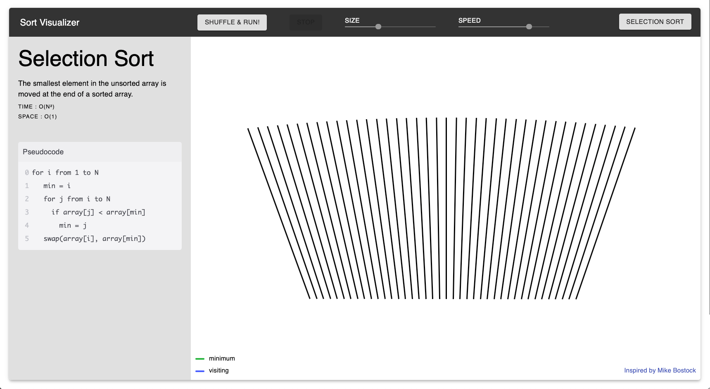

# Sort Visualizer
# 

[Try sort visualizer!](https://sort-visualizer.jmerville.com/)

## What is Sort Visualize?
Sort Visualizer is a web app that shows how a few popular sorting algoritms operate on an array.

## How was it made?
Sort Visualizer is a React web app made using TypeScript and the react library Material UI.

## What's next for Sort Visualizer?
Currently I am working on bringing sort visualizer to mobile devices. In the future I hope to add the following algorithms:
- Quick Sort
- Counting Sort
- Radix Sort
- Bucket Sort

As well as implement a feature that would show which line of code is currenlty being executed in the pseudocode tab.